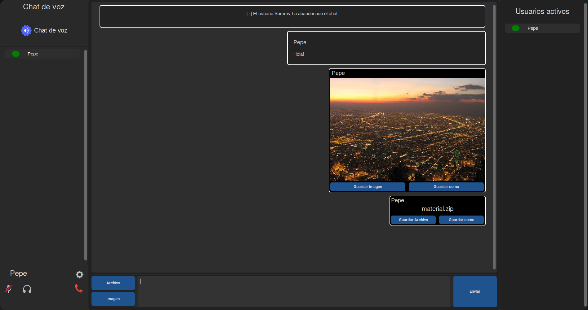

# Didiscord

    

Didiscord es una aplicación de chat multiusuario, con ella podrás enviar mensajes, imágenes, archivos e incluso conversar mediante un chat de voz con las personas que se encuentren en el.

La aplicación se encuentra totalmente construida en Python, trabaja con sockets para la comunicación en tiempo real, mientras que toda la interfaz gráfica está construida con CustomTkinter.
